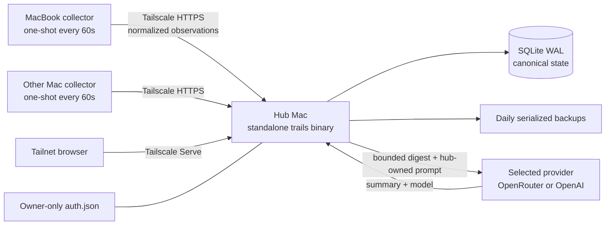

# Multi-device architecture

**Status:** Implemented on `main`  
**Decision:** One hub Mac owns Trails and also collects its own sessions. Tailscale is optional and adds private access for other Macs. Optional summaries go directly from the hub to one provider the owner explicitly connects.

## System



The hub process always binds only to `127.0.0.1:7412`. In the default one-Mac mode, the app stays local at `http://127.0.0.1:7412/`; the same binary runs the server, collector, and backup roles.

Multi-Mac setup adds Tailscale as the private network and HTTPS access boundary. `--tailscale` uses the hub machine's MagicDNS URL. `--service svc:trails` instead advertises through a pre-defined Tailscale Service and reports the stable `https://trails.<tailnet>.ts.net/` URL. Named services are opt-in because they require a tag-authenticated host, tailnet administrator configuration, and service-host approval. Tailscale does not run or store Trails, and Trails never opens a LAN socket.

## Standalone distribution

`bun run build` creates `dist/trails-darwin-arm64` and `dist/trails-darwin-x64`. Each executable embeds:

- the Bun runtime
- `bun:sqlite`
- the compiled CLI, collector, API, summary supervisor, and provider login/runtime connectors
- the complete `dist/client` React build and fonts

Target Macs run the matching file without Bun, Node, a source checkout, or sidecar assets. Source and release machines require Bun 1.3.14 or newer.

## Release transport

`bun run release:stage` runs the production web and standalone binary builds, then writes a deterministic product-owned staging directory under `dist/release/trails/<version>/`. It contains both architecture binaries, the POSIX installer pinned to immutable HTTPS paths and SHA-256 hashes, `SHA256SUMS`, and `release-input.json`. Trails does not contain Cloudflare credentials or assume a sibling checkout path.

The public release boundary begins after staging. The shared [`Manzanita-Research/releases`](https://github.com/Manzanita-Research/releases) repository validates the registered product, manifest schema, file types, paths, sizes, and hashes; refuses any immutable collision; uploads to a private R2 bucket; and exposes only read-only `GET`/`HEAD` access through `https://releases.manzanita.dev/`.

The stable bootstrap and alpha channel are:

```text
https://releases.manzanita.dev/trails/install.sh
https://releases.manzanita.dev/trails/channels/alpha.json
```

Versioned objects under `/trails/releases/<version>/` are immutable and cached long-term. Channel manifests and `/trails/install.sh` are mutable, briefly cached pointers. Publication uploads and publicly verifies every versioned artifact before updating the alpha channel and bootstrap installer last, so a partial release never becomes current.

Operator flow:

```sh
# Trails repository
bun run release:stage

# Shared releases repository
bun run publish -- \
  --from /absolute/path/to/trails/dist/release/trails/<version> \
  --channel alpha \
  --dry-run
bun run publish -- \
  --from /absolute/path/to/trails/dist/release/trails/<version> \
  --channel alpha
```

Promotion and rollback change only mutable pointers to an already verified immutable version:

```sh
bun run promote -- \
  --product trails \
  --version <already-published-version> \
  --channel alpha \
  --dry-run
```

Remove `--dry-run` after review. Selecting an older version rolls back without deleting or mutating release objects.

## Canonical hub state

`trails serve` opens `~/.manzanita/trails/trails.sqlite` with WAL, foreign keys, and a five-second busy timeout. Ordered migrations create:

- machine-scoped sessions and minute activity
- server-owned settings, project assignments, display names, engagements, and pocket items
- session/day summaries
- durable, guarded inference jobs

Every bootstrap-visible change increments one monotonic revision. Replayed ingestion, last-seen timestamps, duplicate engagement creation, and exact preference no-ops do not. Browsers poll `/api/bootstrap?after=<revision>` while visible and retain the last snapshot through temporary failures.

There is no scan-blob or localStorage compatibility path. Transcript history is re-ingested from source logs.

## Periodic collectors

`com.manzanita.trails.collector` runs `trails collect --once` at load and every 60 seconds. It is not a resident daemon and has no KeepAlive loop.

Each run:

1. Acquires the state-specific PID lock for the entire cycle.
2. Discovers live Claude, Codex, omp, and pi logs plus Claude/Codex restored roots.
3. Compares size/mtime fingerprints; a new target or machine identity deliberately empties the effective fingerprint set.
4. Parses changed files concurrently, eight at a time.
5. Validates canonical protocol records and uploads batches of at most 50 sequentially.
6. Retries network errors, 408, 429, and 5xx responses three times on exponential two-second spacing.
7. Atomically checkpoints only ignored files proven stable and parsed files whose accepted batch matches the pre/post stat.

Live copies win over restored duplicates. Claude/Codex subagents and CodexBar probes are excluded. Malformed individual JSONL lines are skipped; unreadable files and terminal upload failures remain uncheckpointed and make the command nonzero after other files finish. omp/pi forks ignore replayed parent entries older than the child session header.

Collector state is mode 0600 at `~/.local/state/trails/collector-state.json`. Repeatable `--source-root source=/absolute/path` replaces the defaults. A custom `--state` derives a custom lock and never reads or creates the real state directory.

## Wire privacy

The collector sends:

- source-local session ID, source, cwd, and branch
- canonical start/end timestamps and event totals
- short first prompt
- UTC epoch-minute activity buckets
- a bounded summary digest

It never sends a transcript path or body. The hub scopes identity by `(machine_id, source, source_session_id)`, hashes decoded records in fixed field order, and exposes only global SQLite IDs to browsers. Browser bootstrap contains no source session ID, digest, or path.

## Summary work

Ingest settles a changed digest for five minutes, then the supervisor checks due SQLite jobs every 30 seconds and processes at most two concurrently. Network requests time out at 120 seconds and never hold a database transaction.

Session jobs capture a digest hash. Day jobs capture a generation and an ordered member hash. A completion or failure mutates state only if those guards still match; a newer ingest cannot be overwritten by a stale model response. Failures retain the durable row with exact exponential minute backoff capped at one hour. One-member day summaries copy without a model; zero-member rebuilds remove stale summaries.

The provider boundary is hub-owned and off by default:

- `~/.config/trails/server.json` protocol V2 stores only the active `{ provider, model? }` selection, or `null`;
- `~/.config/trails/auth.json` stores Trails-owned provider credentials keyed by provider;
- both files are mode 0600 under an owner-only directory and are written atomically;
- credential changes and ChatGPT refresh-token rotation use a mode-0600, `O_EXCL` lock with stale-lock recovery, so the server and CLI cannot overwrite each other;
- credentials never enter SQLite, collector traffic, browser responses, feedback, or logs.

The first alpha connectors are:

| Provider | Login | Request path | Notes |
|---|---|---|---|
| OpenRouter | recommended PKCE exchange, or API key | OpenRouter chat completions | the PKCE exchange returns a user-revocable API key |
| ChatGPT Plus/Pro | OpenAI Codex device-code OAuth | ChatGPT Codex Responses SSE | labeled unofficial; Trails owns its login and refresh tokens and never reads Codex, omp, or pi credentials |
| OpenAI API | API key | OpenAI chat completions | key entry is password-masked in Settings or piped over CLI stdin |

Login and activation are separate operations. A successful login only updates `auth.json`. `trails use PROVIDER` or the Settings confirmation writes `server.json` and allows queued jobs to resume. A failed login leaves the previous credential and active provider untouched. `trails disconnect` clears only the active selection; `trails logout PROVIDER` removes that credential and also disconnects it if active.

The supervisor rebuilds the effective connector from disk on every 30-second poll, so configuration changes need no process restart. An in-flight request retains the connector it started with, while its digest/generation guard still prevents a stale completion from overwriting newer input. Trails never falls back to a second provider automatically.

Trails owns the session and day system prompts. Provider requests carry only the prompt, the bounded digest, and provider-specific model controls. Session input is capped at 9,000 characters, day input at 12,000 characters, output at 4,000 characters, and requests at 120 seconds. Browser status exposes only provider, model, login/active state, attempt/success timestamps, and one closed error class: `auth_required`, `quota`, `provider_rejected`, `timeout`, `protocol`, or `network`.

A V1 `server.json` relay configuration is read as summaries disconnected. Trails logs one retirement notice; the first V2 write preserves the old file as `server.json.v1.bak`. There is no relay compatibility connector, token forwarding, or automatic migration to a provider.

## launchd operations

The compiled installer manages only these labels:

| Label | Schedule | Command |
|---|---|---|
| `com.manzanita.trails.server` | RunAtLoad, restart after failure | `trails serve --port 7412` |
| `com.manzanita.trails.collector` | RunAtLoad, every 60s | `trails collect --once` |
| `com.manzanita.trails.backup` | 03:00 daily | `trails backup --output-dir … --retain 14` |

Program arguments and working directories are absolute. The user LaunchAgent receives the owner's `HOME` and a minimal explicit `PATH`; provider calls use Trails' embedded connectors, not an interactive shell or another agent CLI. Logs are mode 0600 under `~/.local/state/trails`. `install --dry-run` performs preflight and prints the complete plan without writing files or changing processes. Server installation requires Tailscale only when `--tailscale` or `--service` exposure is requested; collector installation requires collector configuration.

The installer bootouts, bootstraps, and kickstarts only its exact labels. It never edits or reads Claude, Codex, omp, pi, or OpenCode provider configuration. Provider setup is hub-only and changes only Trails' owner-only files.

## Backup and restore

`trails backup` uses SQLite serialization, not a copy of the WAL-mode main file. It writes and fsyncs a mode-0600 temporary snapshot, atomically renames it, and prunes only matching Trails backup names after success. The daily launchd job retains 14 snapshots.

Restore is intentionally manual: stop the server label, remove stale WAL/SHM sidecars, place the verified snapshot at the canonical database path with mode 0600, and bootstrap the server label. A restored copy should pass `PRAGMA integrity_check` before it becomes the only copy.

## Failure modes

- **Hub unavailable:** collectors retry on their next scheduled run; browser views retain the latest loaded snapshot but mutations cannot complete.
- **Collector file changes during parsing:** the file is not checkpointed and is retried next run.
- **Collector crash:** the next process steals only a lock whose recorded PID is dead.
- **No active provider:** collection and UI continue; summary jobs remain pending without being sent anywhere.
- **Authentication, quota, provider, timeout, protocol, or network failure:** the closed error class is recorded; the durable job backs off and remains queued.
- **Provider changes during a request:** the request finishes against its original provider; digest/generation guards discard a stale result, and the next poll uses the newly confirmed selection.
- **Tailscale conflict:** installation stops before writing when `/` already proxies somewhere else.
- **Database loss:** transcript-derived sessions can be re-ingested, but user-authored preferences and pocket state require a backup.

## Alternatives rejected

- **Manzanita inference relay or full Cloudflare app:** requires hosted credentials, grants, quotas, abuse controls, and vendor-specific operations for data the hub can send directly to the owner's provider.
- **Shelling out to Codex, omp, pi, or OpenCode:** couples unattended jobs to installed CLI versions, interactive output, session/config side effects, and another process's provider selection.
- **Reading another harness's credentials:** breaks credential ownership, depends on private file formats, and creates unsafe cross-process refresh races.
- **Raw transcript synchronization:** duplicates private logs and preserves partial-write, path-layout, deletion, and collision problems.
- **Multi-master SQLite:** introduces conflict resolution without a peer-to-peer write requirement.
- **Session-end hooks:** the previous full-rescan hooks missed pi and coupled agent shutdown to repository scripts; periodic idempotent one-shots cover every source and survive binary installation.

## Decision statement

> Trails is a local-first, single-owner service hosted on one Mac, which is also its first collector. Tailscale optionally connects more Macs. Optional summaries go directly from the hub to one explicitly selected provider. Cloudflare is limited to public release transport and opt-in feedback, never inference or canonical storage.
