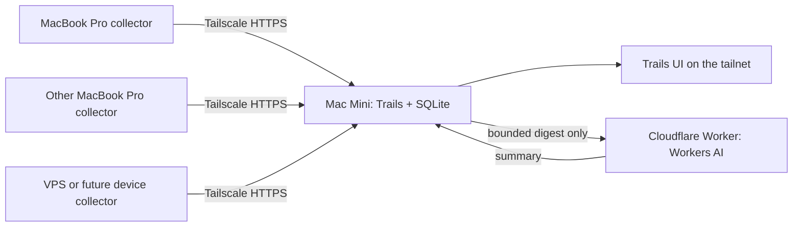

# Multi-device architecture

**Status:** Proposed  
**Decision:** Run Trails on an always-on Mac Mini behind Tailscale. Keep Cloudflare as an optional, narrowly scoped inference provider rather than the canonical data store.

## Summary

Trails should be a local-first, single-owner service. The Mac Mini hosts the application, ingestion API, SQLite database, shared UI state, and summaries. Each work machine runs a small collector that submits normalized session observations over the tailnet.



Tailscale supplies the private network and access boundary. It does not run or store Trails; the Mac Mini does.

## How Trails is stored today

There is no application database yet.

### Raw session logs

`scripts/scan.ts` reads local agent logs from:

- `~/.claude/projects`
- `~/.codex/sessions`
- `~/.omp/agent/sessions`
- `~/.pi/agent/sessions`

It writes `public/data/scan.json`, containing session IDs, agent source, absolute transcript paths, working directories, branches, timestamps, per-minute activity, and a short first-prompt snippet. It does not copy complete transcript bodies into the scan.

### Summaries

`scripts/summarize.ts` rereads each local transcript, constructs a bounded digest, calls `/api/summarize`, and writes `public/data/summaries.json`.

The digest can include the first 20 user messages, truncated to 400 characters each, and the final three assistant messages, truncated to 600 characters each. Complete transcripts are not sent to the inference service.

### Browser state

Assignments, engagement names, settings, and divergence-pocket items are stored under the `trails.*` browser `localStorage` namespace. Every browser therefore has an independent copy; state does not synchronize across devices.

### R2 archive

The existing R2 integration belongs to the separate `records` archive. Trails can restore archived transcripts from it during backfill, but R2 is not Trails' live store.

## What Cloudflare does today

The Worker exposes one route:

```text
POST /api/summarize
```

That route invokes Workers AI and returns text. The repository defines no D1 database, R2 binding, KV namespace, Durable Object, or queue.

During local development, Vite serves the UI and generated JSON locally while Wrangler proxies the Workers AI binding through Cloudflare. During deployment, the React application, Worker, `scan.json`, and `summaries.json` are built into one Cloudflare deployment.

This means the deployed application is a snapshot:

- Local session hooks update local JSON files, not deployed assets.
- A new deployment is required to publish later scans.
- Generated scan data includes project paths, branches, activity, and prompt snippets.
- `worker/index.ts` does not authenticate the summarization endpoint.

Deploying the current application as-is is therefore not a multi-device storage architecture and is not an appropriate privacy boundary.

## Recommended architecture

### Device collectors

Every work machine runs a small Trails collector that:

1. Reads only that machine's agent logs.
2. Performs an initial historical import.
3. Parses only the ended session after a session-shutdown hook.
4. Submits a normalized, idempotent record to the Mini.
5. Optionally constructs the bounded AI digest locally, leaving raw transcripts on the source machine.

Session identity must include its origin:

```text
machine_id + source + session_id
```

This prevents collisions and retains provenance. The existing Claude, Codex, and omp session-end hooks can become collector triggers; they currently launch a full local rescan.

### Mac Mini service

Run one production Bun process on the Mini, bound to `127.0.0.1`. It should provide:

- the built React application
- `POST /api/ingest`
- read APIs for sessions, days, and summaries
- APIs for project assignments, engagement names, settings, and thread state
- summarization coordination
- a SQLite database at `~/.manzanita/trails/trails.sqlite`

A likely initial schema:

- `machines`
- `sessions`
- `session_activity`
- `session_summaries`
- `day_summaries`
- `project_assignments`
- `engagements`
- `thread_state`
- `settings`

SQLite in WAL mode is sufficient. The workload is small, writes are naturally centralized, and ordinary file-level backup remains possible.

### Tailscale access

Use Tailscale Serve to reverse-proxy the localhost service to a tailnet-only HTTPS address:

```bash
tailscale serve --bg http://127.0.0.1:7412
```

The exact syntax should be checked against the installed Tailscale version. The resulting application is available to authorized tailnet devices without exposing a LAN port or public internet endpoint.

### Cloudflare inference

Cloudflare can remain a small inference relay:

1. The collector or Mini creates the bounded digest.
2. The Mini sends that digest to the Worker.
3. Workers AI returns a summary.
4. The Mini stores the summary in SQLite.

Before deploying that relay, protect it with a service token or Cloudflare Access machine credential. A later local model on the Mini could replace it without changing the storage architecture.

## Alternatives considered

### Full Cloudflare application

A complete hosted design would use Worker + D1 + Access + device uploaders. It offers high availability but introduces hosted personal data, authentication, deployment state, and Cloudflare-specific storage. It may suit a public Manzanita product later; it is unnecessary for three personal Macs now.

### Raw transcript synchronization

Syncthing or `rsync` into per-machine directories on the Mini could prove aggregation quickly, but it would duplicate raw logs and retain path-layout, partial-write, deletion, collision, and full-rescan problems. It is a temporary experiment, not the durable store.

### Multi-master SQLite replication

This adds conflict resolution without a requirement for peer-to-peer writes. The Mini should own the database; other machines submit immutable session observations and mutable UI changes through its API.

## Privacy boundary

- Raw transcripts remain on their source machines and in the existing owner-controlled archive.
- Normalized metadata travels only over the tailnet.
- Only bounded digests travel to the inference provider.
- The Mini stores derived metadata, summaries, and user-authored state.
- The SQLite database must be backed up because user-authored assignments and thread state are not fully derivable from transcripts.

## Availability tradeoff

When the Mini is unavailable, Trails is unavailable. That is acceptable for an always-on home server and avoids running a public personal-data service. A read-only client cache could be added later if offline access becomes important.

## Build order

1. **Network proof:** Run the current application on the Mini and expose it with Tailscale Serve. This proves access but still shows only the Mini's scan and keeps browser state separate.
2. **Central store:** Add the Bun server and SQLite schema; import the current scan, summaries, and browser state.
3. **Device ingestion:** Add machine identity, historical import, and idempotent incremental session submission.
4. **Shared UI state:** Move persistent `localStorage` fields to server-backed state while leaving navigation-only state local.
5. **AI hardening:** Protect the Cloudflare inference relay or replace it with local inference.
6. **Operations:** Run the Mini service under `launchd` and back up the SQLite database.

## Decision statement

> Trails is a local-first, single-owner service hosted on the user's always-on machine and reached through Tailscale. Cloudflare is an optional inference provider, not the canonical data store.
