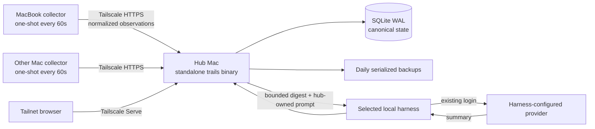

# Multi-device architecture

**Status:** Implemented on `main`  
**Decision:** One hub Mac owns Trails and also collects its own sessions. Tailscale is optional and adds private access for other Macs. Optional summaries run through one coding harness already installed and authenticated on the hub.

## System



The hub process always binds only to `127.0.0.1:7412`. In the default one-Mac mode, the app stays local at `http://127.0.0.1:7412/`; the same binary runs the server, collector, and backup roles.

Multi-Mac setup adds Tailscale as the private network and HTTPS access boundary. `--tailscale` uses the hub machine's MagicDNS URL. `--service svc:trails` instead advertises through a pre-defined Tailscale Service and reports the stable `https://trails.<tailnet>.ts.net/` URL. Named services are opt-in because they require a tag-authenticated host, tailnet administrator configuration, and service-host approval. Tailscale does not run or store Trails, and Trails never opens a LAN socket.

Server installation persists that exact HTTPS origin as a `--trusted-origin` LaunchAgent argument. The hub accepts only configured Host authorities (plus loopback names at its listening port), ignoring forwarding headers. Browser mutation origins must match the addressed authority and configured public scheme; Fetch Metadata must indicate same-origin when present. Requests carrying browser metadata without Origin are rejected. Native collectors may omit both. Existing installations must rerun setup with their exposure options to populate this allowlist; a Tailscale hostname change likewise requires setup again. These boundary checks are separate from client authentication.

## Standalone distribution

`bun run build` creates `dist/trails-darwin-arm64` and `dist/trails-darwin-x64`. Each executable embeds:

- the Bun runtime
- `bun:sqlite`
- the compiled CLI, collector, API, summary supervisor, and harness adapters
- the complete `dist/client` React build and fonts

Target Macs run the matching file without Bun, Node, a source checkout, or sidecar assets. Source and release machines require Bun 1.3.14 or newer.

## Release transport

`bun run release:stage` runs the production web and standalone binary builds, then writes a deterministic product-owned staging directory under `dist/release/trails/<version>/`. It contains both architecture binaries, the POSIX installer pinned to immutable HTTPS paths and SHA-256 hashes, `SHA256SUMS`, `release-input.json`, and a local `release-audit.json` report binding the audited asset/module inventory and policy to the staged hashes. Staging statically validates both Mach-O architectures, the Bun payload allowlist, privacy patterns, installer syntax, and descriptor integrity. The report is reproducible with `bun scripts/stage-release.ts --audit <staging-directory>`; it is not a public transport object. Trails does not contain Cloudflare credentials or assume a sibling checkout path.

The public release boundary begins after staging. The shared [`Manzanita-Research/releases`](https://github.com/Manzanita-Research/releases) repository validates the registered product, manifest schema, file types, paths, sizes, and hashes; refuses any immutable collision; uploads to a private R2 bucket; and exposes only read-only `GET`/`HEAD` access through `https://releases.manzanita.dev/`.

The stable bootstrap and alpha channel are:

```text
https://releases.manzanita.dev/trails/install.sh
https://releases.manzanita.dev/trails/channels/alpha.json
```

Versioned objects under `/trails/releases/<version>/` are immutable and cached long-term. Channel manifests and `/trails/install.sh` are mutable, briefly cached pointers. Publication uploads and publicly verifies every versioned artifact before updating the alpha channel and bootstrap installer last, so a partial release never becomes current.

Operator flow:

```sh
# Trails repository
bun run release:stage

# Shared releases repository
bun run publish -- \
  --from /absolute/path/to/trails/dist/release/trails/<version> \
  --channel alpha \
  --dry-run
bun run publish -- \
  --from /absolute/path/to/trails/dist/release/trails/<version> \
  --channel alpha
```

Promotion and rollback change only mutable pointers to an already verified immutable version:

```sh
bun run promote -- \
  --product trails \
  --version <already-published-version> \
  --channel alpha \
  --dry-run
```

Remove `--dry-run` after review. Selecting an older version rolls back without deleting or mutating release objects.

## Canonical hub state

`trails serve` opens `~/.manzanita/trails/trails.sqlite` with WAL, foreign keys, and a five-second busy timeout. Ordered migrations create:

- machine-scoped sessions and minute activity
- server-owned settings, project assignments, display names, engagements, and pocket items
- session/day summaries
- durable, guarded inference jobs

Every bootstrap-visible change increments one monotonic revision. Replayed ingestion, last-seen timestamps, duplicate engagement creation, and exact preference no-ops do not. Browsers poll `/api/bootstrap?after=<revision>` while visible and retain the last snapshot through temporary failures.

There is no scan-blob or localStorage compatibility path. Transcript history is re-ingested from source logs.

## Hub authentication and pairing

Network access and the Host/Origin allowlist are followed by application authentication. The owning OS account initializes a random owner token beside the database (`<db-path>.owner-token`, mode 0600); HTTP callers cannot bootstrap an owner. `trails auth owner` retrieves it for browser sign-in. The database stores only SHA-256 token hashes. Browser sessions last at most 12 hours, end on server restart/sign-out, and recheck the owner's credential ID on every request so owner rotation invalidates them. HTTPS authorities use a Secure, host-only `__Host-` cookie; loopback uses a separate host-only cookie. Cookie writes also require a matching Origin.

The owner controls reads and administrative writes, including summary activation. Read credentials have no write permissions. Collector credentials have only session/capture ingest and collector-status permission and must match the payload's device ID. An owner cannot accidentally use the owner credential as a collector token. Neither anonymous callers nor collectors can list registered machine IDs.

`trails setup hub` provisions its local collector. For a spoke, the hub account issues a credential file using `trails auth pair --server HUB_URL --output pairing.json [--device-id EXISTING_ID] [--name NAME]`. Transfer it privately, then run `trails setup join HUB_URL --pairing-file pairing.json` on the spoke. The server URL must match, including the origin/port. Import stores the credential in the mode-0600 collector config; upload progress files never contain the token. Native uploads send a Bearer header and refuse redirects. Changing the hub or resetting the device ID clears the old credential and requires pairing again.

Pairing files are long-lived credentials until revoked, not one-time public invitations. `trails auth list` lists IDs and scopes, and `trails auth revoke ID` removes a credential immediately without removing collected history. Multiple credentials can bind the same device during replacement; revoke old credentials explicitly. `trails auth rotate-owner` rotates owner access independently. BB and Herdr use separate, URL-bound mode-0600 `~/.config/trails/reader.json` credentials issued with `trails auth read --server HUB_URL --output reader.json`.

Existing anonymous collectors stop uploading after upgrade until paired. Preserve their existing device IDs and rerun hub setup with the same exposure options. See [the authentication migration](README.md#authentication-and-upgrading-an-existing-hub) for local, tailnet, and read-integration steps. No live installation is changed by building this source. The trust boundary is the single owner account, not other local accounts or every reachable tailnet peer.

### Capture ownership and provider accounts

Pairing a collector does not grant access to another device's captures. Without an explicit account assignment, capture V1 uses a legacy namespace per provider: the first submitting device owns each provider record. Replays from another device return HTTP 403, including identical replays. The whole batch rolls back, including machine metadata, images, attention, project attribution, and the state revision. Upgrading preserves the stored machine as the original owner; it cannot reconstruct ownership already overwritten before this fix.

For the same provider account collected on multiple devices, the hub's owning OS account must assign each paired device to the same opaque account ID. Deduplication then uses `(account ID, provider, provider record ID)`. Devices assigned to different accounts can store identical provider record IDs independently. Account IDs are local labels, not provider credentials, and Trails does not verify provider login identity. Only assign devices after confirming they collect the same account. Each device has one account assignment per provider; ingest payloads cannot select or change it.

```sh
trails auth capture-account --source midjourney --device-id DEVICE_A --account personal-art
trails auth capture-account --source midjourney --device-id DEVICE_B --account personal-art
```

Assignments authorize future writes in that account; they do not move existing history. To reconcile a legacy capture, explicitly select its numeric capture ID and expected original owner after assigning that owner device to the target account:

```sh
trails auth capture-reconcile --source midjourney --capture-id 42 --owner-device-id DEVICE_A --account personal-art
```

Reconciliation preserves the capture ID, content, images, attribution, and original owner. It refuses a mismatched owner/source, an already scoped capture, or an existing record with the same key in the destination account. There is no automatic merge, cross-account transfer, or collector-controlled transfer. Authorized subsequent replays may update content and the last-uploading machine, while the original owner remains recorded. Null project attribution on replay preserves existing attribution. Parent-capture links resolve only within the same account (or the same legacy owner).

Use `--source granola` for Granola. All commands accept `--db PATH`. Inspect assignments locally with `SELECT * FROM capture_device_accounts` and legacy IDs with `SELECT id, source, owner_machine_id FROM captures WHERE account_id = ''` in the hub database. Remove an assignment with `trails auth capture-account --source midjourney --device-id DEVICE_B --revoke`; this removes access to that account and returns future uploads to legacy ownership rules, without deleting history. Revoke the collector credential with `trails auth revoke ID` to stop all uploads. Reassigning a device to a different account leaves its previous account's history intact.

## Periodic collectors

`com.manzanita.trails.collector` runs `trails collect --once` at load and every 60 seconds. It is not a resident daemon and has no KeepAlive loop.

Each run:

1. Acquires the state-specific PID lock for the entire cycle.
2. Discovers live Claude, Codex, omp, and pi logs plus Claude/Codex restored roots.
3. Compares size/mtime fingerprints; a new target or machine identity deliberately empties the effective fingerprint set.
4. Parses changed files concurrently, eight at a time.
5. Validates canonical protocol records and uploads batches of at most 50 sequentially.
6. Retries network errors, 408, 429, and 5xx responses three times on exponential two-second spacing.
7. Atomically checkpoints only ignored files proven stable and parsed files whose accepted batch matches the pre/post stat.

Live copies win over restored duplicates. Claude/Codex subagents and CodexBar probes are excluded. Malformed individual JSONL lines are skipped; unreadable files and terminal upload failures remain uncheckpointed and make the command nonzero after other files finish. omp/pi forks ignore replayed parent entries older than the child session header.

Collector state is mode 0600 at `~/.local/state/trails/collector-state.json`. Repeatable `--source-root source=/absolute/path` replaces the defaults. A custom `--state` derives a custom lock and never reads or creates the real state directory.

## Wire privacy

The collector sends:

- source-local session ID, source, cwd, and branch
- canonical start/end timestamps and event totals
- short first prompt
- UTC epoch-minute activity buckets
- a bounded summary digest

It never sends a transcript path or body. The hub scopes identity by `(machine_id, source, source_session_id)`, hashes decoded records in fixed field order, and exposes only global SQLite IDs to browsers. Browser bootstrap contains no source session ID, digest, or path.

## Summary work

Ingest settles a changed digest for five minutes, then the supervisor checks due SQLite jobs every 30 seconds and processes at most two concurrently. Network requests time out at 120 seconds and never hold a database transaction.

Session jobs capture a digest hash. Day jobs capture a generation and an ordered member hash. A completion or failure mutates state only if those guards still match; a newer ingest cannot be overwritten by a stale model response. Failures retain the durable row with exact exponential minute backoff capped at one hour. One-member day summaries copy without a model; zero-member rebuilds remove stale summaries.

The harness boundary is hub-owned and off by default:

- `~/.config/trails/server.json` protocol V3 stores only the active `{ harness }` selection, or `null`;
- supported selections are `auto`, `omp`, `claude`, `codex`, `opencode`, and `pi`;
- auto mode resolves the first installed executable in that order;
- the configuration is mode 0600 under an owner-only directory and written atomically;
- Trails never reads, copies, refreshes, or stores harness credentials.

Settings or `trails summaries use HARNESS` activates a selection and allows queued jobs to resume. `trails summaries off` pauses the queue without modifying harness state. A selected executable must exist before activation.

Each call runs non-interactively in a fresh mode-0700 temporary directory. Digest input is passed through stdin or a mode-0600 temporary file rather than a command argument. OMP and Pi run without tools, extensions, skills, or session persistence; Claude Code runs in safe mode without tools or session persistence; Codex keeps its existing authentication but ignores user configuration and disables shell, computer, browser, app, plugin, MCP, web-search, multi-agent, skill, hook, and memory features in addition to a read-only sandbox; OpenCode runs pure with wildcard tool permission denied. Temporary input and output are removed after the process exits.

The supervisor re-reads selection every 30-second poll, so changes need no restart. An in-flight request retains the harness it started with, while digest/generation guards prevent stale completion from overwriting newer input. Auto mode does not resend a failed request through another harness.

Trails owns the session and day system prompts. Harness calls carry only the prompt and bounded digest. Session input is capped at 9,000 characters, day input at 12,000 characters, output at 4,000 characters, process output at 1 MiB, and calls at 120 seconds. Browser status exposes only harness availability, selection, attempt/success timestamps, and one closed error class: `auth_required`, `quota`, `harness_failed`, `timeout`, or `protocol`.

Provider-era V1/V2 server configuration is invalid under V3 and is not retained as a compatibility path. On a recognized alpha.7 upgrade, the installer stops the old server, validates and removes the exact owner-only Trails provider credential file, and writes summaries off in V3. The operator must still revoke old provider grants or keys at the provider. Unexpected file type, ownership, permissions, or schema aborts with manual-remediation guidance.

## launchd operations

The compiled installer manages only these labels:

| Label | Schedule | Command |
|---|---|---|
| `com.manzanita.trails.server` | RunAtLoad, restart after failure | `trails serve --port 7412` |
| `com.manzanita.trails.collector` | RunAtLoad, every 60s | `trails collect --once` |
| `com.manzanita.trails.backup` | 03:00 daily | `trails backup --output-dir … --retain 14` |

Program arguments and working directories are absolute. The server resolves supported harnesses from owner-local executable directories and standard Homebrew/system paths rather than relying on an interactive shell. Logs are mode 0600 under `~/.local/state/trails`. `install --dry-run` performs preflight and prints the complete plan without writing files or changing processes. Server installation requires Tailscale only when `--tailscale` or `--service` exposure is requested; collector installation requires collector configuration.

The installer bootouts, bootstraps, and kickstarts only its exact labels. Trails invokes the chosen harness but never edits or reads its provider configuration or credential files.

## Backup and restore

`trails backup` uses SQLite serialization, not a copy of the WAL-mode main file. It writes and fsyncs a mode-0600 temporary snapshot, atomically renames it, and prunes only matching Trails backup names after success. The daily launchd job retains 14 snapshots.

Restore is intentionally manual: stop the server label, remove stale WAL/SHM sidecars, place the verified snapshot at the canonical database path with mode 0600, and bootstrap the server label. A restored copy should pass `PRAGMA integrity_check` before it becomes the only copy.

## Failure modes

- **Hub unavailable:** collectors retry on their next scheduled run; browser views retain the latest loaded snapshot but mutations cannot complete.
- **Collector file changes during parsing:** the file is not checkpointed and is retried next run.
- **Collector crash:** the next process steals only a lock whose recorded PID is dead.
- **No active harness:** collection and UI continue; summary jobs remain pending without being sent anywhere.
- **Missing login, quota, harness, timeout, or protocol failure:** the closed error class is recorded; the durable job backs off and remains queued.
- **Harness changes during a request:** the request finishes against its original harness; digest/generation guards discard a stale result, and the next poll uses the newly confirmed selection.
- **Tailscale conflict:** installation stops before writing when `/` already proxies somewhere else.
- **Database loss:** transcript-derived sessions can be re-ingested, but user-authored preferences and pocket state require a backup.

## Alternatives rejected

- **Manzanita inference relay or full Cloudflare app:** requires hosted credentials, grants, quotas, abuse controls, and vendor-specific operations for data the hub can send directly to the owner's provider.
- **Shelling out to Codex, omp, pi, or OpenCode:** couples unattended jobs to installed CLI versions, interactive output, session/config side effects, and another process's provider selection.
- **Reading another harness's credentials:** breaks credential ownership, depends on private file formats, and creates unsafe cross-process refresh races.
- **Raw transcript synchronization:** duplicates private logs and preserves partial-write, path-layout, deletion, and collision problems.
- **Multi-master SQLite:** introduces conflict resolution without a peer-to-peer write requirement.
- **Session-end hooks:** the previous full-rescan hooks missed pi and coupled agent shutdown to repository scripts; periodic idempotent one-shots cover every source and survive binary installation.

## Decision statement

> Trails is a local-first, single-owner service hosted on one Mac, which is also its first collector. Tailscale optionally connects more Macs. Optional summaries run through one explicitly selected coding harness on the hub. Cloudflare is limited to public release transport and opt-in feedback, never inference or canonical storage.
